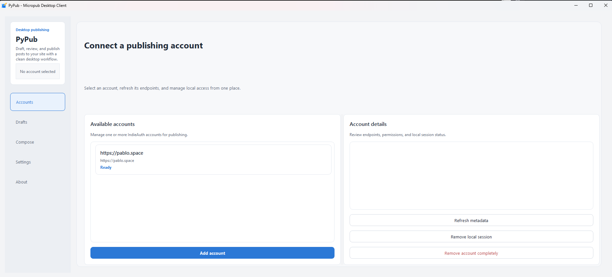

PyPub
=====

A native desktop Micropub client for Windows.

PyPub allows you to authenticate with your domain via IndieAuth, draft posts (text, markdown, html), attach media, and publish to your Micropub endpoint. Local data is kept in an SQLite database, and session tokens are securely handled by the Windows Credential Manager.

REQUIREMENTS
------------
* Windows 10/11 (x64)
* Python 3.12+ (if running from source)

BUILD INSTRUCTIONS
------------------
To run locally or build the standalone executable:

1. Install dependencies:
   pip install -e .[dev]

2. Run system tests:
   python -m pytest -v

3. Build executable:
   .\build.ps1

   Fast iteration (skip pip + pytest; use only with a ready venv):
   .\build.ps1 -Fast

The standalone .exe will be deposited in `dist/PyPub/`. The build script packages into a staging folder, runs a Qt/WebEngine bundle check (`scripts/verify-frozen-bundle.ps1`), smoke-tests the executable, then promotes to `dist/`. UPX compression is disabled in `pypub.spec` to avoid broken Qt/Shiboken DLLs.

For a console build to debug startup errors, see `docs/BUILD.md` (`PYPUB_PYI_CONSOLE`).

You can pack the folder using Inno Setup Compiler targeting `installer.iss`.

ARCHITECTURE
------------
* Python 3.12+
* UI: PySide6 (Qt6)
* Data: SQLite 3
* Credentials: Windows Credential Locker (python-keyring)
* Data Sanitation: nh3
* Build Toolchain: PyInstaller + Inno Setup

SUPPORT & CONTACT
-----------------
Author: Pablo Murad
Email: pmurad@disroot.org

That's it. See you.
